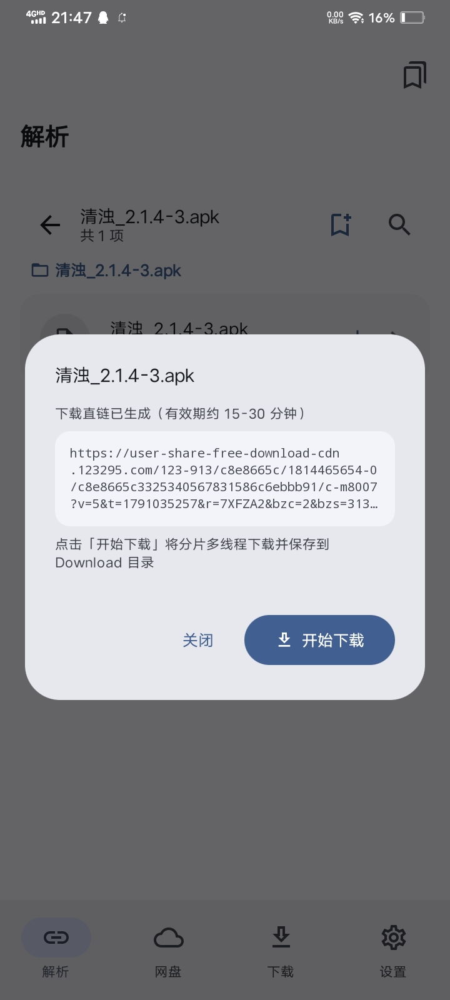
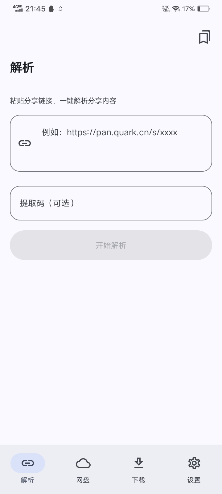
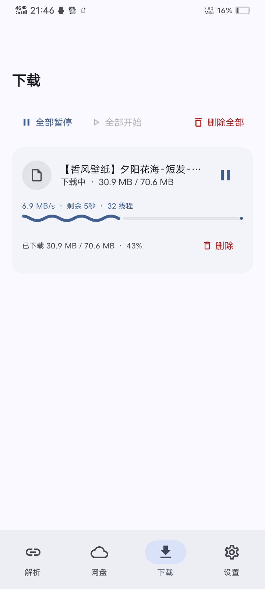
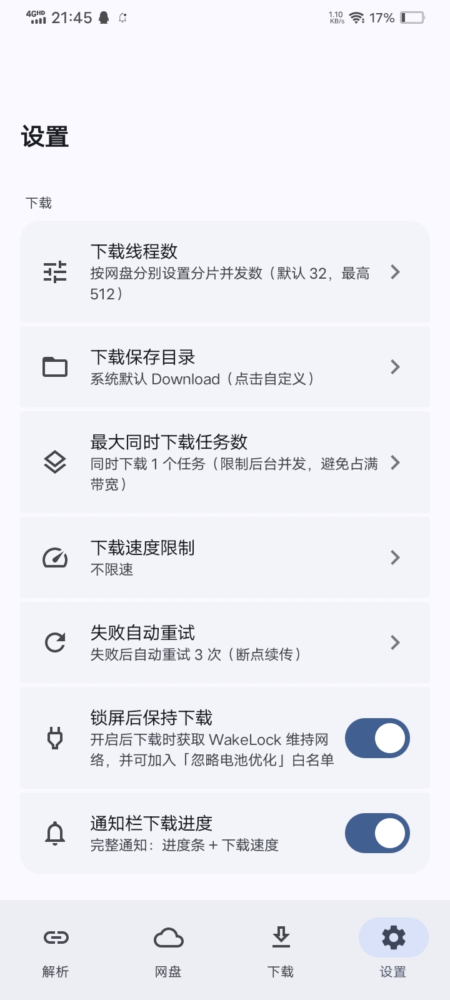

<div align="center">


# 云析 · YunX

**粘贴分享链接，直接高速下载 —— 一个开源的 Android 网盘解析下载应用**

识别夸克 / UC / 迅雷 / 百度 / 139 / 123 分享链接，自动匹配提取码，Range 分片并发 + 断点续传。

[](https://github.com/CYQawa/YunX/releases/latest)
[](https://github.com/CYQawa/YunX/stargazers)
[](./LICENSE)
[](#构建)
[](https://kotlinlang.org/)
[](https://developer.android.com/jetpack/compose)

[下载最新版](https://github.com/CYQawa/YunX/releases/latest) · [功能](#功能) · [使用](#使用) · [构建](#构建) · [常见问题](#常见问题)

[](http://qm.qq.com/cgi-bin/qm/qr?...&group_code=635207650)

</div>

---

> **云析永远免费开源。** 如果你是在任何地方"花钱买到"的，说明你被骗了，请立即退款。
> 任何收费版本均为二次打包的诈骗版本，与本项目无关。

> **云析使用AGPL-3.0开源协议** 如果你使用了云析的代码，未经授权请遵守协议，同样以AGPL-3.0开放源代码

## 截图

| | | |
|:---:|:---:|:---:|
|  |  |  |
| 解析直链 | 分享解析 | 下载管理 |
|  |  |  |
| 网盘登录 | 设置 | 关于 |

## 功能

- **分享链接解析** —— 识别夸克 / UC / 迅雷 / 百度 / 139 / 123 的分享链接，自动匹配提取码
- **高速下载** —— Range 分片并发 + 断点续传，任务保存请求头与固定分片规划，并发上限 32
- **临时转存清理** —— 百度 / 迅雷取链后清理；夸克保留到下载完成或删除任务后清理
- **多平台登录** —— 夸克 / UC / 百度 / 139 使用 WebView Cookie；迅雷使用密码 / 短信；123 使用账号密码换取 JWT
- **认证备份** —— 使用用户口令派生密钥，以 AES-GCM 加密 Cookie / JWT 备份文件
- **剪贴板识别** —— 复制分享链接后回到应用，提示一键粘贴解析

## 支持平台

- 夸克网盘
- UC 网盘
- 迅雷网盘
- 百度网盘
- 123 云盘
- 139 网盘（和彩云）

> [!WARNING]
> **不建议使用百度网盘，可能导致账号被风控！**

> [!NOTE]
> 其他网盘暂未支持，如有需要请开一个 [issue](https://github.com/CYQawa/YunX/issues)。

## 使用

1. 在「网盘」页登录需要使用的网盘账号
2. 在「解析」页粘贴分享链接（可带提取码）
3. 浏览分享内容，点击文件获取下载直链
4. 在「下载」页查看进度，支持暂停 / 继续 / 删除 / 打开

## 技术栈

| 分类 | 选型 |
|---|---|
| 语言 | Kotlin |
| UI | Jetpack Compose + Material 3 |
| 持久化 | Room（KSP 注解处理）+ SharedPreferences |
| 网络 | OkHttp 4.12.0（请求 + 分片下载） |
| 构建 | Gradle + KSP |

## 构建

要求：minSdk 21，targetSdk 34。

```bash
git clone https://github.com/CYQawa/YunX.git
```

用 Android Studio 打开项目直接构建即可。项目在 AndroidIDE 上开发调试，理论上也兼容其它 Android 构建环境。

## 常见问题

<details>
<summary><b>百度网盘下载/转存不了？</b></summary>

你的账号被风控了，见issue #9
</details>

<details>
<summary><b>能否开发PC端？</b></summary>

我个人没有电脑，故无法开发pc端。社区内已有人开发PC移植
</details>

## 反倒卖

>
> 云析完全免费开源。如果你下载到要钱的版本，那么你就是被骗了，请立马去退款。

- 倒卖狗 🐶：`qq1360735243`

## 免责声明

本项目仅供个人学习与技术交流，请勿用于商业用途。下载内容版权归原作者所有，请在下载后 24 小时内删除。使用本项目产生的任何后果由使用者自行承担。

## 开源协议

本项目基于 [GNU AGPL-3.0](https://www.gnu.org/licenses/agpl-3.0.html) 协议开源，详见根目录 [LICENSE](./LICENSE)。

## Star History

[](https://www.star-history.com/?repos=YunX%2FYunX%2CCYQawa%2FYunX&type=date&legend=top-left)
